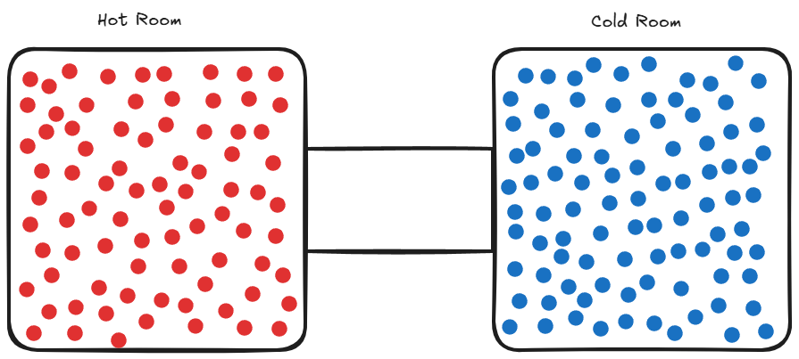

# Voltage, Current and Resistor

Voltage, current and resistance are the fundamental parts of the electricity and electronics. These concepts are really important and used in every field of electronics.

## Voltage

Voltage (V) is the electrical potential difference between two points. It can be thought of as the "push" that moves electrons through a circuit. 

A real-life analogy is **temperature difference**: Imagine two rooms, one hot and one cold. Heat naturally flows from the hot room to the cold room. Similarly, electrons flow from high voltage to low voltage. The bigger the temperature difference, the stronger the heat flow — just like a higher voltage creates a stronger push for electrons.

  

## Current

## Resistor

---