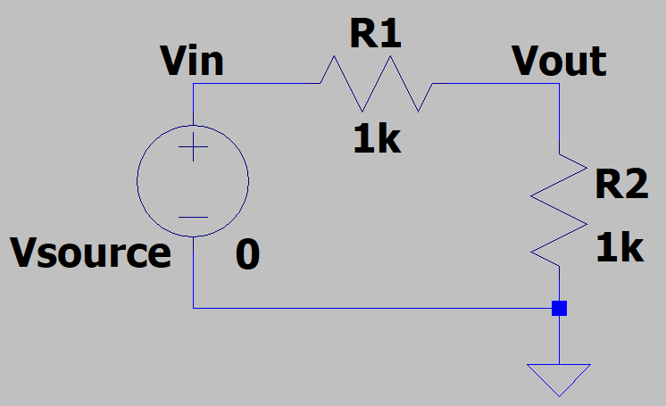
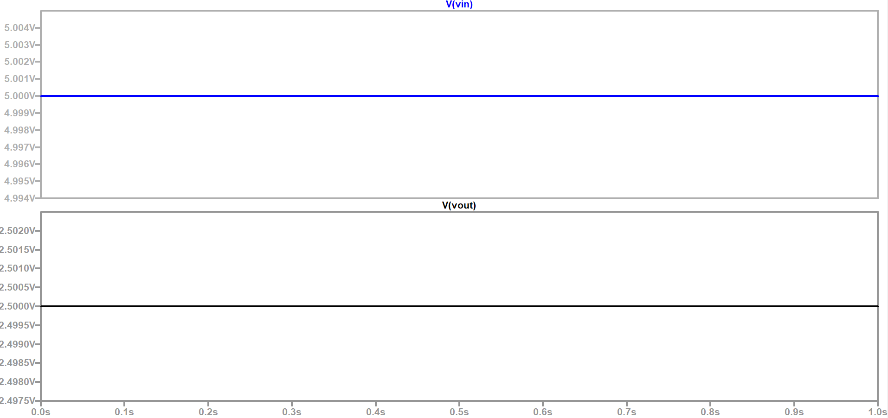

# Voltage Divider

The **voltage divider** is one of the most fundamental circuits in electronics.  
It is used to scale down an input voltage to a lower output voltage using two resistors in series.  

For example, it is possible to scale down `5V` logic into `3.3V` logic level.

---

## Circuit

  

The output voltage is given by:

$$
V_{out} = V_{in} \cdot \frac{R2}{R1 + R2}
$$

---

## Applications

- Level shifting (scaling down voltages for microcontrollers)  
- Reference voltage generation  
- Signal conditioning  

---

## Simulation in LTSpice

1. Open the `Voltage_Divider.asc` file in **LTSpice**.  
2. Run the simulation (`Simulate -> Run`).  
3. Probe the `Vout` node to see how the output voltage relates to the resistor values.  
4. Try changing `R1` and `R2` to observe the effect on `Vout`.  

---

## Example

For:

- Vin = 5V  
- R1 = 1kΩ  
- R2 = 1kΩ

Then using the formula below:

$$
V_{out} = V_{in} \cdot \frac{R2}{R1 + R2}
$$

Output voltage is calculated:

$$
V_{out} = 5V \cdot \frac{1kΩ}{(1kΩ + 1kΩ)} = 2.5V
$$

Results for the LTSpice is given below:

  

---